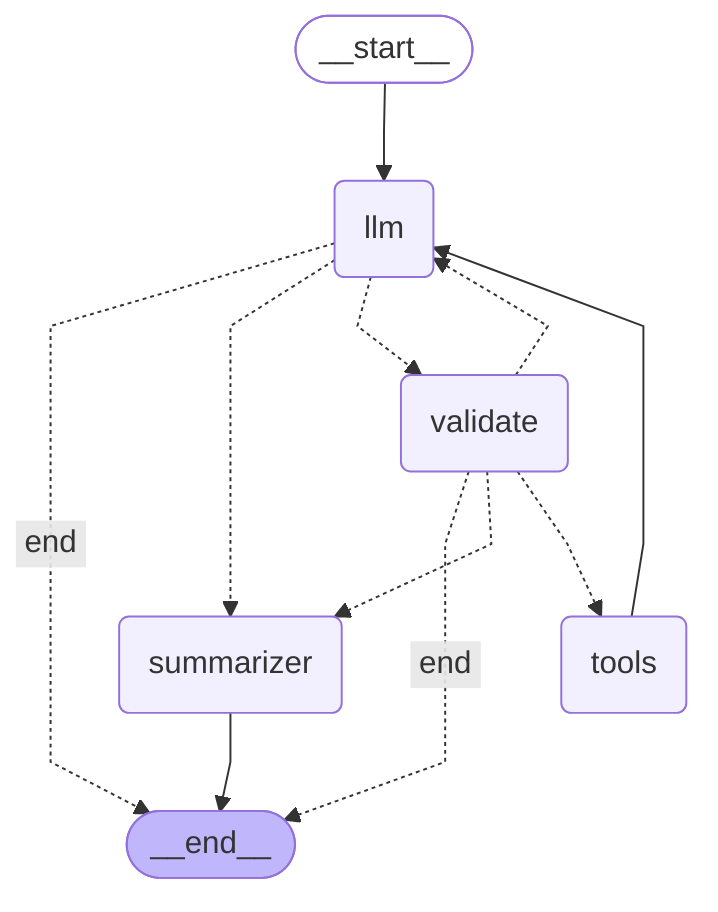

# Learning Agentic AI — From Scratch to Production

> A hands-on, module-by-module journey building production-grade AI agents.
> Each module pairs a focused tutorial with a working implementation, progressing
> from raw API calls to deployed multi-agent systems with full observability and governance.

[](https://www.python.org/downloads/)
[](https://opensource.org/licenses/MIT)
[]()

---

## Why This Repo

Most agent tutorials wrap LangChain around an OpenAI call and call it production.
This repo goes the other way: build the loop yourself first, then layer in frameworks,
memory, evaluation, governance, and deployment — each module solving a problem the
previous module exposed.

**Target audience:** data scientists and engineers who want to add agentic AI to their
toolkit with real depth, not buzzword-level familiarity.

---

## Curriculum Roadmap

| Module | Focus | Status |
|--------|-------|--------|
| **1. Foundations** | ReAct loop, tool calling, multi-provider fallback | ✅ Complete |
| **2.1 LangGraph** | State machines, validation nodes, checkpointing | ✅ Complete |
| **2.3 Multi-Agent** | CrewAI, role-based agents, orchestration patterns | 🚧 Next |
| **3. Memory & RAG** | Persistent state, vector retrieval, context engineering | ⏳ Planned |
| **4. Production Architecture** | Async, streaming, caching, orchestration patterns | ⏳ Planned |
| **5. Observability & Eval** | Tracing, eval datasets, LLM-as-judge | ⏳ Planned |
| **6. Governance & Guardrails** | Prompt injection, output validation, OWASP LLM Top 10 | ⏳ Planned |
| **7. Deployment & Capstone** | Docker, K8s, end-to-end production agent | ⏳ Planned |

---

## Module 1 — Foundations

**Goal:** Build a tool-calling agent from scratch, no frameworks, and learn what every
framework abstracts away.

### What's inside

- ReAct loop (Reason → Act → Observe) implemented in plain Python
- Three tools: `calculator`, `fetch_url`, `read_file`
- OpenAI-compatible client targeting Gemini, Ollama, and any other compatible provider
- Multi-provider fallback chain with exponential backoff
- Per-turn and per-run token accounting
- `MAX_TURNS` circuit breaker for runaway loops
- Tools that return errors as strings instead of raising exceptions

### Key concepts demonstrated

- The two-layer tool pattern (schema vs implementation)
- `stop_reason` as agent control flow
- Parallel vs sequential tool calls — and the non-determinism that makes them tricky
- Provider rate limits, quota errors, and graceful degradation
- Model self-imposed refusals (small models over-refuse repetitive requests)
- Why hosted APIs usually beat self-hosted models for low-end hardware

### Run it yourself

```bash
git clone https://github.com/ankitpani8/learning_AgenticAI.git
cd learning_AgenticAI
python -m venv .venv
.venv\Scripts\activate              # Windows
# source .venv/bin/activate         # macOS/Linux
pip install -r requirements.txt
cp .env.example .env                # then add your GEMINI_API_KEY
python module1_foundations/agent_Gemini.py
```

Get a free Gemini API key at [aistudio.google.com](https://aistudio.google.com).


---

## Module 2.1 — LangGraph

**Goal:** Replace Module 1's hand-written ReAct loop with a state machine, and
use the new structure to add capabilities the loop couldn't easily support.

### What's inside

- Full LangGraph agent: typed state, three nodes (`llm`, `validate`, `tools`),
  conditional routing
- Validation node that rejects unsafe tool arguments and routes back to the LLM
- `MemorySaver` checkpointer for state persistence across invocations
- Multi-provider LLM fallback (Gemini Flash-Lite → Flash) encapsulated in one node
- Mermaid graph diagram exported directly from the compiled graph

### Key concepts demonstrated

- Control flow as graph topology, not embedded conditionals
- Reducers (`add_messages` append vs default replace)
- The `tool_call_id` ↔ `ToolMessage` contract
- Composability: how graph structure localizes future changes
- Defense in depth: LLM safety training + orchestration-layer guardrails
- Silent topology failures and why they motivate observability (Module 5)

### Why this matters
A `while` loop with `if/elif` works for one agent. Once you have multiple
specialized agents, parallel subagents, retry strategies that vary by error
type, or human-in-the-loop pauses — you need first-class control flow.
LangGraph (or something like it) is what every production agent system
converges on. Module 2.1 is where that transition happens in this repo.

See [`module2_langgraph/README.md`](module2_langgraph/README.md) for the
architecture diagram and detailed findings.


## Tech Stack

- **Python 3.11+**
- **OpenAI SDK** (used as the OpenAI-compatible client for any provider)
- **Google Gemini API** — primary LLM provider (free tier)
- **httpx** — async-ready HTTP client
- **python-dotenv** — environment variable management

## Module 2 — LangGraph

Replaces Module 1's hand-written ReAct loop with a state machine built on
LangGraph, exposing why production agents need first-class control flow.

### What's new vs Module 1

- Agent expressed as a graph of nodes and edges, not a loop
- Typed state schema with reducers (append vs replace semantics)
- Validation node that inspects tool arguments and routes back to the LLM
  when they fail rules — pattern foundation for Module 6 guardrails
- Checkpointer (in-memory; SQLite-ready) for state persistence and resumption
- Mermaid diagram exported directly from the compiled graph



## Repo Structure
learning_AgenticAI/
├── .env.example              # Template for required environment variables
├── .gitignore
├── LICENSE
├── README.md                 # You are here
├── requirements.txt          # Pinned dependencies
└── module1_foundations/      # Foundations - building an agent from scratch in Python - without frameworks
    ├── agent_Claude.py
    ├── agent_Gemini_and_Ollama.py
    ├── tools.py
    └── README.md
└── module2_langgraph/        # Module 2.1: LangGraph agent
    ├── agent.py
    ├── state.py
    ├── tools.py
    ├── test_checkpoint.py
    ├── graph.mmd
    └── README.md
├── agent_Gemini.py
├── tools.py
└── README.md

---

## Notes for Visitors

This is an active learning project. Each module is tagged on GitHub
(e.g., `v0.1.0-module1`) — browse the [Releases](../../releases) page to see
milestone-by-milestone progress with summaries.

I'm documenting findings publicly because most production lessons in agentic AI
aren't in the docs — they're in the failure modes. This repo captures both.

---

## Connect

- LinkedIn: [@ankitpani](https://www.linkedin.com/in/ankitpani/)
- GitHub: [@ankitpani8](https://github.com/ankitpani8)

---

## License

MIT — see [LICENSE](LICENSE).


