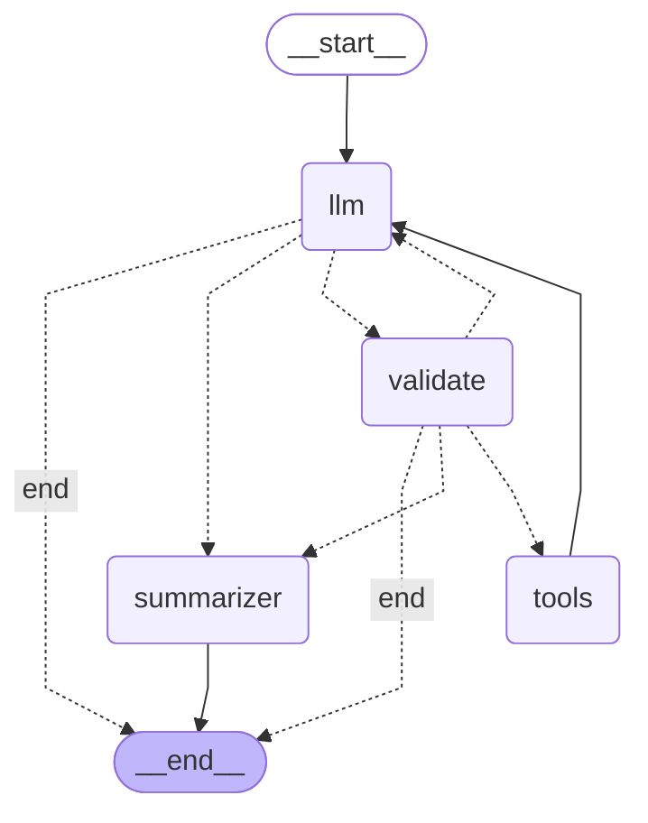

# Module 2 — LangGraph Agent

Module 1's hand-written ReAct loop, rebuilt as a state machine on **LangGraph**.
Same three tools, same behavior on simple queries — but now extensible, inspectable,
and resumable.

## Architecture



## Filesmodule2_langgraph/
├── agent.py              # Graph definition, nodes, routing, provider fallback
├── state.py              # Typed AgentState schema
├── tools.py              # @tool-decorated calculator, fetch_url, read_file
├── test_checkpoint.py    # Demonstrates state persistence across invocations
└── README.md             # You are here

## What's new vs Module 1

- Agent expressed as a graph of nodes and edges, not a `while` loop
- Typed state schema with reducers (append vs replace semantics)
- **Validation node** that inspects tool arguments before execution and routes
  back to the LLM when they fail rules — the foundation for Module 6 guardrails
- **Checkpointer** (`MemorySaver`) for state persistence and resumption across
  invocations using a `thread_id`
- **Multi-provider fallback** encapsulated inside the LLM node:
  Gemini Flash-Lite → Gemini Flash, with rate-limit-aware skipping and
  exponential backoff on transient errors
- Mermaid diagram exported directly from the compiled graph

## Key concepts demonstrated

### Control flow as graph structure
Routing decisions live in dedicated functions (`route_after_llm`,
`route_after_validate`) returning a route name, mapped to nodes via
`add_conditional_edges`. The graph topology *is* the agent's logic — visible,
diffable, and renderable as a diagram.

### Reducers
`messages` uses the `add_messages` reducer (append). All other state fields use
the default reducer (replace). Forgetting `Annotated[list, add_messages]` on
`messages` is the most common LangGraph bug for beginners.

### One ToolMessage per tool_call_id
Every `tool_call` emitted by the LLM must be answered with a corresponding
`ToolMessage` before the next LLM call, or the API errors. The validation node
respects this contract by emitting one rejection `ToolMessage` per rejected
tool call, not just one for the whole batch.

### Provider fallback inside a node
The fallback chain is encapsulated in `call_llm_with_fallback()` and called
from `llm_node`. Other nodes are unaffected. This is the composability payoff
of the graph model: provider strategy changes localize to one place.

## Findings from manual testing

### 1. The validator can't be exercised through prompt-only tests
Asked the LLM to fetch `"example.com"` (no scheme) — the model auto-corrected
to `"https://example.com"` before emitting the tool call, so the validator saw
valid args and passed them through.

**Lesson:** modern instruction-tuned models silently clean up tool inputs
(adding URL schemes, normalizing paths, fixing typos in well-known domains).
This is usually helpful, but it means **you cannot test guardrails by going
through the LLM**. Validators are deterministic functions and must be tested
directly with hand-crafted bad inputs:

```pythonfrom langchain_core.messages import AIMessage
from agent import validate_nodebad_state = {
"messages": [AIMessage(content="", tool_calls=[
{"id": "x", "name": "fetch_url", "args": {"url": "no-scheme.com"}}
])],
"turn_count": 0,
"last_validation": "",
}
print(validate_node(bad_state))  # should reject

### 2. Defense in depth: model refusal vs validator rejection
A path-traversal probe (`read_file('../../etc/passwd')`) was refused by the LLM
itself before the tool call was ever emitted. The validator never fired.

This is **defense in depth working as intended** — either layer alone might
fail, and both together catch the attack. Production guardrails always layer:
input filtering → model safety training → orchestration-layer validation →
tool sandboxing → output filtering.

### 3. Broken graph topology fails silently, not loudly
Removing the `tools → llm` edge did **not** cause `compile()` to error.
LangGraph treats nodes with no outgoing edges as terminal. The agent ran,
called one tool, and "completed" with the raw tool output (`88031`) as its
final answer instead of a model-written response.

**Lesson:** `compile()` catches structural errors that are obviously wrong
(edges to nonexistent nodes, unregistered route targets), but **silent
topology bugs that just produce degraded output** are caught only by:

- Tracing and inspecting message graphs (Module 5)
- Asserting on final-message types (`AIMessage`, not `ToolMessage`)
- Running evaluation datasets and watching for quality regressions

This is one of the strongest arguments for observability tooling — many
agent failures look exactly like this in the wild: *"the agent technically ran,
but the answer is weird."*

### 4. Provider fallback localizes change
Adding the fallback chain (Flash-Lite → Flash) required modifying only
`llm_node` and the provider-list helper. Validation, tool execution, routing,
and state schema were all untouched. Compare to Module 1 where adding
fallback changed the main loop. **This is the composability lesson made
concrete.**

## Run it yourself

```bashcd module2_langgraph
python agent.py                       # main agent
python agent.py --diagram             # export Mermaid graph source
python test_checkpoint.py             # demonstrate state persistence

Requires `GEMINI_API_KEY` in the repo-root `.env` file.

## What's next

Module 2.3 introduces **multi-agent systems** (CrewAI), where the question
becomes: when does a single graph stop being enough, and when do you need
multiple agents collaborating?