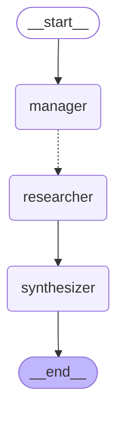
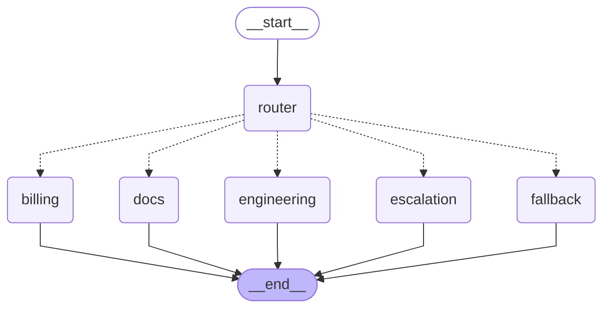

# Module 3 — Multi-Agent Systems

Three multi-agent patterns implemented as separate, runnable scripts, plus
theory on two more. Built on the role-based selection system in
[`lib/providers.py`](../lib/providers.py) so any agent's model can be swapped
without touching agent code.

## What "multi-agent" means here

A multi-agent system is one in which two or more LLMs, each configured with
its own role, instructions, and tools, collaborate on a task that no single
agent solves alone. The specialization is what makes it multi-agent — having
multiple LLM calls in a loop does not.

## Topology and role policy are orthogonal

Multi-agent systems vary on two independent dimensions:

- **Topology** — how the agents are connected (sequential, hierarchical,
  router+experts, etc.)
- **Role policy** — what kind of cognitive work each agent does, which
  determines which model fits (`heavy` for synthesis, `light` for bounded
  reasoning, `critic` for structured evaluation)

Every topology has nodes; every node has a role. This module uses three
roles consistently across all topologies, defined once in `lib/providers.py`.

## Patterns implemented

### Pattern A — Sequential pipeline

Agents run in a fixed order, each consuming the previous agent's output.
Simple, debuggable, no parallelism.

**Business case:** investment research notes, regulatory document drafting,
technical documentation, incident postmortems. Any workflow producing a
single artifact where different stages need different expertise.

**Files:** `01_sequence_plus_critic_loop_crewAI.py`,
`02_sequence_plus_critic_loop_langgraph.py`

### Pattern D — Evaluator-optimizer (critic loop)

A generator produces output; an evaluator inspects it; rejection routes back
to the generator for revision. Loops until approval or a retry cap.

**Business case:** layered on top of Pattern A when output quality matters
more than latency and a fresh perspective catches errors the writer can't see.
Same files as Pattern A — the critic loop is bolted onto the sequential
pipeline.

### Pattern B — Hierarchical

A manager agent decomposes the task, dispatches workers (often in parallel),
and synthesizes results. Workers don't talk to each other directly.

**Business case:** competitive intelligence on N companies, multi-source
fact-checking, due-diligence research. Any task with N independent subtasks
plus a synthesis step where N is determined at runtime.

**Implementation:** Manager decomposes the user request into per-company
subtasks. LangGraph's `Send` API dispatches researchers concurrently. A
synthesizer merges results into the final brief.

**File:** `03_hierarchical_langgraph.py`

### Pattern C — Router + experts

A lightweight router classifies the request and dispatches to exactly one
specialist. Specialists don't talk to each other and have scoped tools.

**Business case:** customer support triage, internal helpdesks, multi-domain
assistants. The architectural argument is capability scoping — billing can
issue refunds, docs can't, and no single agent has access to every tool.

**Implementation:** classifier router routes to Billing, Engineering, Docs,
Fallback, or Escalation specialists. Each specialist has its own tool surface.

**File:** `04_router_experts_langgraph.py`

### Pattern E — Debate / consensus (theory only)

Multiple agents argue, vote, or negotiate; a judge synthesizes. Not
implemented here because production fits are narrow: formal verification,
multi-jurisdictional legal analysis, ensemble forecasting. In most
practical scenarios, a single larger model produces better results for
5–10× fewer tokens.

## Architecture diagrams





## Findings

### CrewAI vs LangGraph
Both produce comparable output on Pattern A. CrewAI is faster to write for
the "team of specialists" mental model. LangGraph is faster to debug, passes
typed state (not strings), and makes critic loops a first-class graph
construct rather than manual orchestration.

### The multi-agent token tax is real and measurable
On a 3-company task with fast hosted models:
- Sequential: ~9.8s, ~977 tokens
- Hierarchical: ~12.4s, ~2,514 tokens

2.5× the cost for no speedup. Hierarchical starts paying off around
6–10 parallel subtasks and dominates at 20+. **For small N, sequential
wins.** Architects who reach for hierarchical by default are paying
manager-overhead tokens for no gain.

### Parallelism only pays off where the infrastructure supports it
Running the same hierarchical test entirely on local Ollama produced
*slower* wall-clock than sequential — single-instance Ollama serializes
"parallel" requests internally. The pattern requires hosted APIs (Gemini,
Claude, OpenAI) or multi-instance local setups to actually parallelize.
Architect for what you have.

### Hallucination by substitution
Tested with `"...the company that makes the iPhone, plus some random
stuff about Mars."` Small models (Qwen 1.5b as manager) didn't filter
"Mars" — they silently substituted "NASA" and dispatched a researcher on it.
Larger models filter; smaller models rationalize. **The manager is the
single most leverage-rich role in hierarchical systems — always use your
best model there.**

### Router category overlap
When ESCALATION was added as a 5th category in Pattern C, the router
started classifying bug reports as ESCALATION instead of ENGINEERING.
Category boundaries need explicit examples in the router prompt — few-shot
examples are one of the highest-ROI prompt-engineering moves in production
router systems.

### Critics are frequent callers — use small models
The `critic` role in `lib/providers.py` is local-first (Ollama Qwen 1.5b)
by design. Critics produce bounded structured output (find issues, return
list) — heavy models are wasted here. This is the single highest-impact
mitigation for the multi-agent token tax.

## Run it

```bash
cd module3_multiagent

# Pattern A + D (CrewAI)
python 01_sequence_plus_critic_loop_crewAI.py

# Pattern A + D (LangGraph)
python 02_sequence_plus_critic_loop_langgraph.py

# Pattern B
python 03_hierarchical_langgraph.py
python 03_hierarchical_langgraph.py --compare      # parallel vs sequential timing
python 03_hierarchical_langgraph.py --diagram

# Pattern C
python 04_router_experts_langgraph.py
python 04_router_experts_langgraph.py --diagram
```

Requires `GEMINI_API_KEY` in the repo-root `.env`. Optional providers:
Ollama on `localhost:11434`, `ANTHROPIC_API_KEY` for Claude. See
`lib/providers.py` for the full provider preference chain.

## What's next

Module 4 introduces **memory and RAG** — agents that read from persistent
state, retrieve from vector stores, and handle the context-engineering
problem at scale.